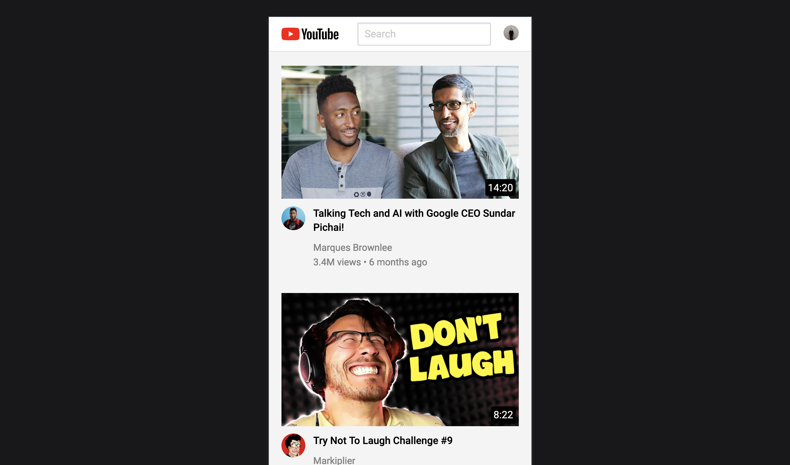

#Clone of YouTube page using HTML and SCSS
In this project, I cloned the YouTube page using HTML and SCSS, and made it responsive with the use of media queries.

##HTML Structure
To clone the YouTube page, I first created the HTML structure for the page, which included the following elements:

Header with logo and navigation menu
Main content section with recommended videos
Sidebar with trending videos and subscription options
Footer with additional links and copyright information
I used semantic HTML elements to structure the page and improve its accessibility.

##SCSS Styles
Once the HTML structure was in place, I added SCSS styles to create the visual design of the page. I used a modular SCSS approach, with separate files for typography, colors, layout, and components.

To create the responsive design, I used media queries to adjust the layout and styles of the page for different screen sizes. For example, I adjusted the number of columns in the recommended videos section and the size and position of the sidebar for smaller screens.

##Conclusion
By using HTML and SCSS, I was able to clone the YouTube page and make it responsive. This project was a great opportunity to practice my HTML and SCSS skills and learn more about building responsive designs.

You can find the full source code for this project on my GitHub repository.

##Preview
Here's the link to preview the project [Youtube Clone](https://)
